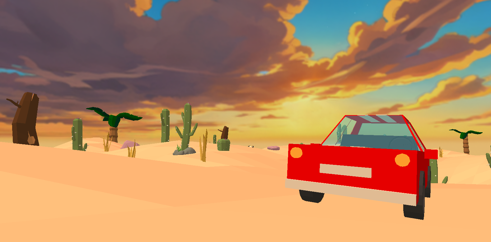

# OpenGL Car Simulator

Un simulateur de voiture en 3D utilisant OpenGL, développé en C++14. Ce projet propose de manipuler le/les véhicule(s) pour découvrir les fonctionnalités qui ont été implémentées dans ce moteur de rendu 3D *"maison"*.

## Fonctionnalités

- Simulation de conduite de voiture en environnement 3D
- Physique rudimentaire (gestion des collisions avec terrain/obstacle, mouvement du véhicule, freinage progressif, braquage des roues/volant...)
- Caméra **No Clip** (*pour le Debug*) et **3rd Person**
- Terrain généré dynamiquement via ***heightmap*** & modèles 3D placées dynamiquement par rapport à celui-ci
- Contrôles clavier et manette (*tester avec une manette Xbox*)
- Rendu graphique avec OpenGL (GLFW, GLAD, GLM)
- Système de shaders personnalisés
- Chargement de modèles 3D externes à l'aide d'Assimp 

## Prérequis

- Windows 10/11
- Visual Studio 2022
- OpenGL 4.2+
- [GLFW](https://www.glfw.org/), [GLAD](https://glad.dav1d.de/), [GLM](https://github.com/g-truc/glm), [stb](https://github.com/nothings/stb), [Assimp](https://assimp.org/) (déjà présent dans le repo Github)

## Installation

1. Télécharger le dépôt [Git](https://github.com/KyroSaru/opengl_car_simulator) ou l’archive ZIP du projet.
2. Extraire l’archive si besoin.
3. Ouvrir la solution Visual Studio :  
   `opengl_car_simulator.sln`
4. Générer la solution :  
   __Build > Build Solution__ (ou __Générer > Générer la solution__)
5. Lancer l’application (F5 ou bouton "Démarrer le débogage").

## Touches

- Contrôles clavier et manette disponibles :
    - `Z/Q/S/D (ou Joystick Gauche)` : Déplacement du véhicule ou de la caméra No Clip
    - `Souris (ou Joystick Droit)` : Regarder autour de soi
    - `Entrée` : Ajouter un joueur
    - `Backspace` : Supprimer un joueur
    - `H (ou Y)` : Allumer/Éteindre les phares
    - `W (ou X)` : Activer/Désactiver la visibilité des collision box en wireframe
    - `V` : Switch de caméra
    - `Maj` : Augmenter la vitesse de la caméra No Clip
> **Remarque:** les touches manette sont entre parenthèses et correspondent à celle Xbox.

## Structure du projet

- `VAO, VBO, EBO` : gestion des buffers (tampons)
- `Model, Mesh, Texture` : gestion des modèles 3D importés
- `Shader` : gestion de la compilation des shaders
- `Car` : logique et physique du véhicule
- `Camera` : gestion des vues (no-clip, 3ème personne)
- `Terrain` : génération et rendu du sol
- `JoystickManager, Gamepad, Keyboard` : gestion des entrées
- `Skybox` : rendu du ciel et transitions jour/nuit
- `World` : gestion globale de la scène et des entités

## Remarques
-  Si jamais la sensibilité (clavier ou manette) est trop élevé, elles sont modifiables dans la classe `Camera.h` avec les attributs `sensitivity` et `gamepadSensitivity`.

## Auteurs
- Kenzo
- Maxime
